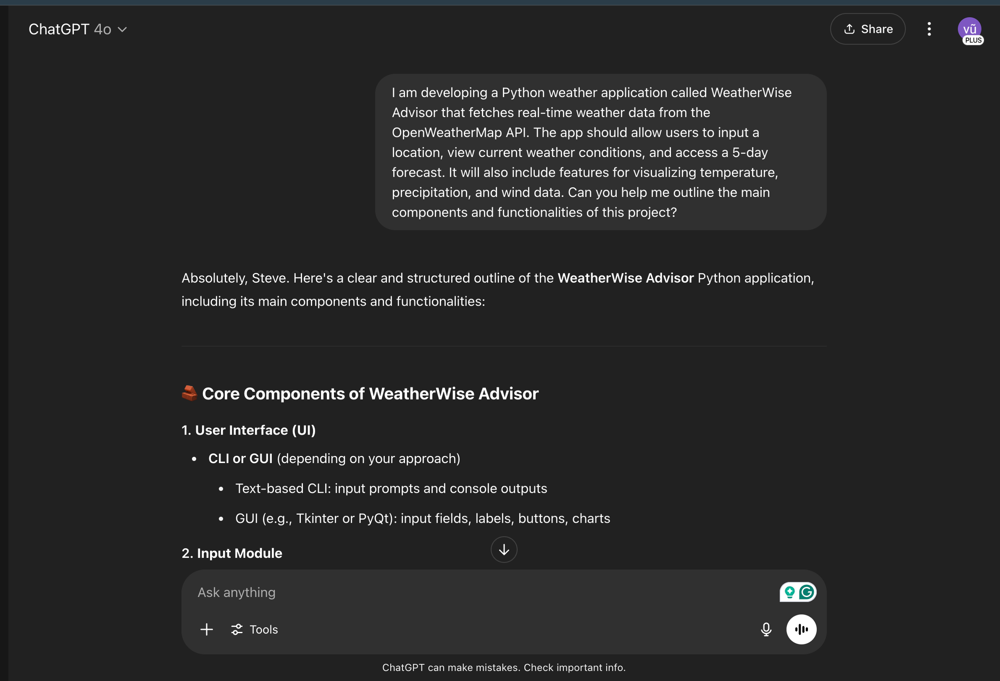
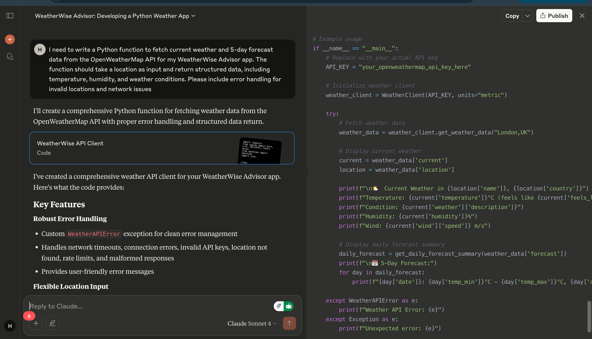
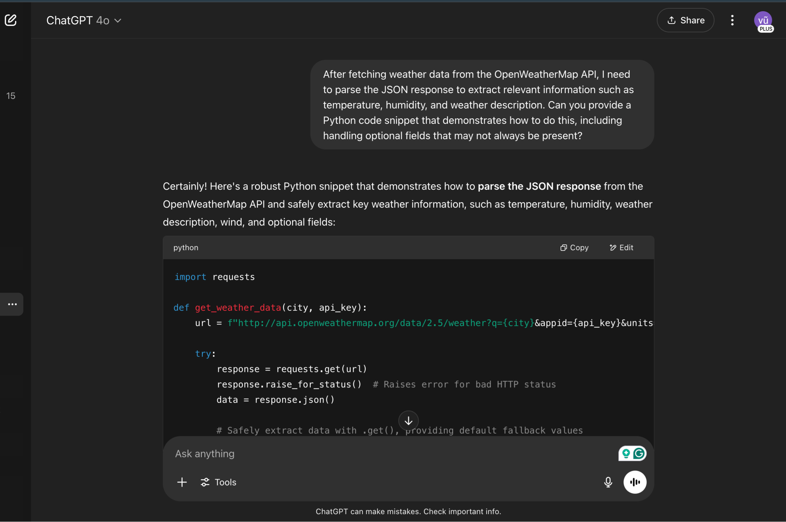
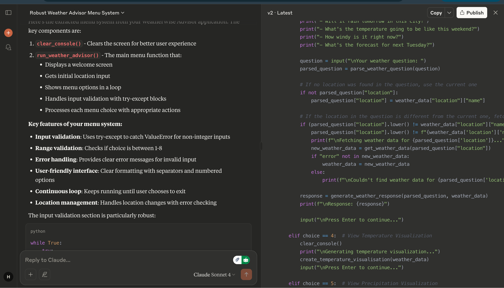
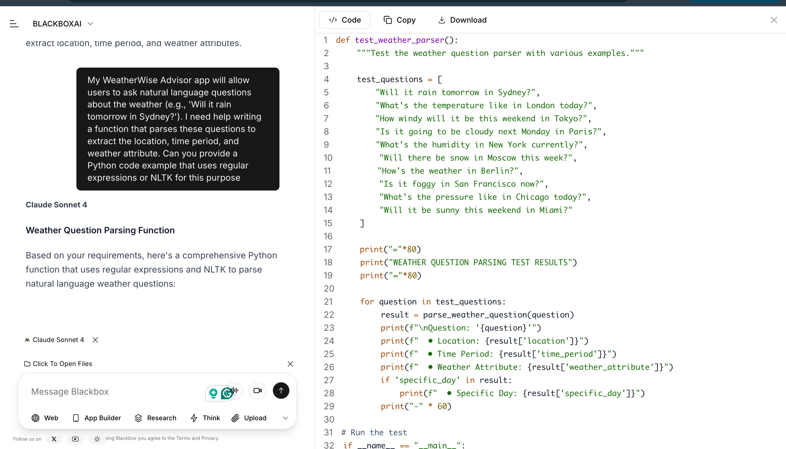
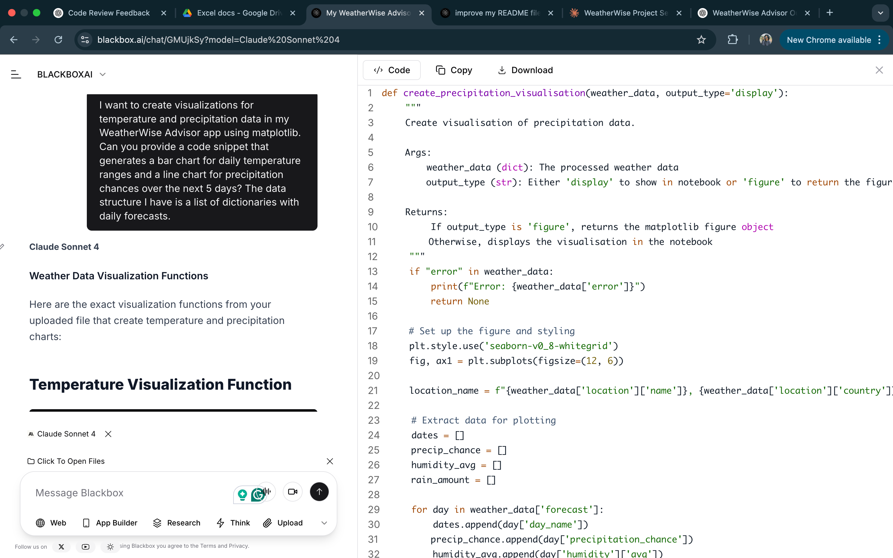
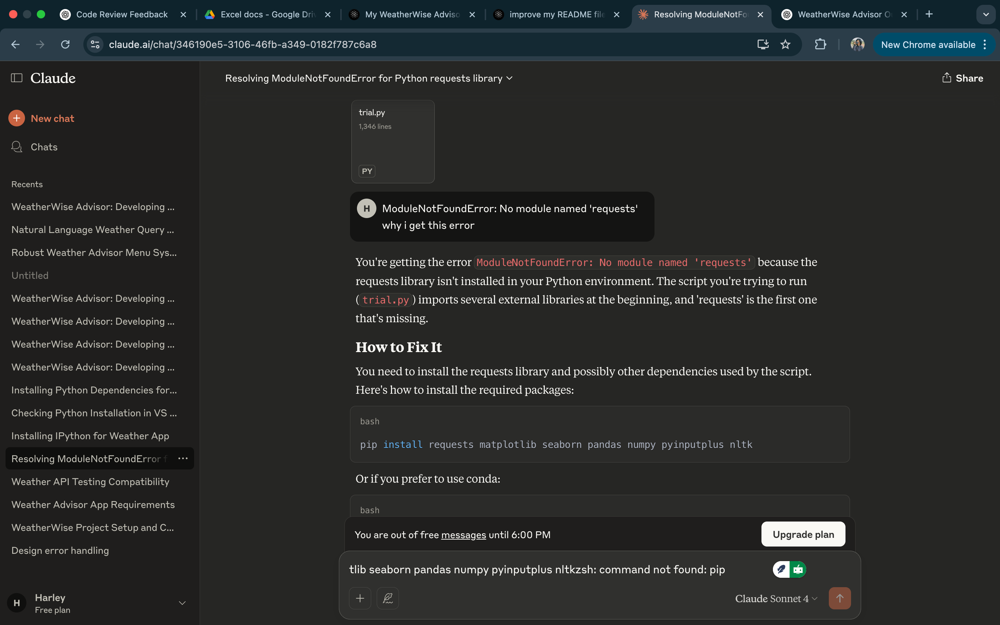

# 🤖 AI Prompting Reflection for WeatherWise Advisor

This file documents the structured prompts used during development of the **WeatherWise Advisor** Python application. Each prompt was crafted to target a specific aspect of the project, using AI tools (ChatGPT, Claude) to guide development in a modular and intentional manner.

---

## Prompt 1: Project Overview

**Prompt:**  
"I am developing a Python weather application called WeatherWise Advisor that fetches real-time weather data from the OpenWeatherMap API. The app should allow users to input a location, view current weather conditions, and access a 5-day forecast. It will also include features for visualizing temperature, precipitation, and wind data. Can you help me outline the main components and functionalities of this project?"

**Purpose:**  
To get a structured overview of the project components and functionalities, which helped in planning the development process.

**Screenshot:**  

---

## Prompt 2: Fetching Weather Data

**Prompt:**  
"I need to write a Python function to fetch current weather and 5-day forecast data from the OpenWeatherMap API for my WeatherWise Advisor app. The function should take a location as input and return structured data, including temperature, humidity, and weather conditions. Please include error handling for invalid locations and network issues."

**Purpose:**  
To generate the core function for fetching weather data, which is essential for the app's functionality.

**Screenshot:**  

---

## Prompt 3: Parsing API Response

**Prompt:**  
"After fetching weather data from the OpenWeatherMap API, I need to parse the JSON response to extract relevant information such as temperature, humidity, and weather description. Can you provide a Python code snippet that demonstrates how to do this, including handling optional fields that may not always be present?"

**Purpose:**  
To ensure the app could handle various data formats and missing fields in the API response.

**Screenshot:**  

---

## Prompt 4: User Input Handling

**Prompt:**  
"In my WeatherWise Advisor app, I want to implement a user input system that allows users to enter a location and choose options from a menu (e.g., view current weather, forecast, visualizations). Can you help me write a Python function that displays a menu and handles user input safely, including validation for invalid choices?"

**Purpose:**  
To make the app user-friendly and robust against invalid inputs.

**Screenshot:**  

---

## Prompt 5: Natural Language Processing

**Prompt:**  
"My WeatherWise Advisor app will allow users to ask natural language questions about the weather (e.g., 'Will it rain tomorrow in Sydney?'). I need help writing a function that parses these questions to extract the location, time period, and weather attribute. Can you provide a Python code example that uses regular expressions or NLTK for this purpose?"

**Purpose:**  
To enable intelligent responses to user queries.

**Screenshot:**  

---

## Prompt 6: Data Visualization

**Prompt:**  
"I want to create visualizations for temperature and precipitation data in my WeatherWise Advisor app using matplotlib. Can you provide a code snippet that generates a bar chart for daily temperature ranges and a line chart for precipitation chances over the next 5 days? The data structure I have is a list of dictionaries with daily forecasts."

**Purpose:**  
To improve the user experience by including data visualizations.

**Screenshot:**  

---

## Prompt 7: Error Handling and Debugging

**Prompt:**  
"While developing my WeatherWise Advisor app, I encountered a KeyError when trying to access certain fields in the API response. Can you explain why this might happen and provide a code example that demonstrates how to handle such errors gracefully in Python?"

**Purpose:**  
To ensure the application remains stable under unexpected conditions.

**Screenshot:**  

---
